# Прототип мобильного приложения клиента

Глава 7, Issue #37, ADR 0011. Кликабельный прототип на Flutter (`mobile/`) с фикстурами по схемам
`docs/openapi.yaml`; тема и компоненты — дизайн-система главы 6 (`docs/design/DESIGN_SYSTEM.md`).

## Запуск
```bash
cd mobile && flutter run -d "iPhone 17"     # iOS Simulator
cd mobile && flutter run -d macos           # macOS
cd mobile && flutter test                   # сценарии прототипа и правило 3-х кликов
```
Код из SMS — `1234`. Панель **«Демо»** (иконка с ползунками в шапке): «Нет сети», авто на аккаунте
(несколько / одно / без авто), тема (системная / светлая / тёмная), «Выйти — к онбордингу».
VIN определяется по первым символам: `LLX…` — Li Auto L7, `L6T…` — Zeekr 001, `LDP…` — Voyah Free;
другой корректный VIN — выбор модели из списка (`VIN_DECODE_FAILED`); `LDPZZZ1Z2RA000777` — привязан к
другому аккаунту (409).

## Карта экранов
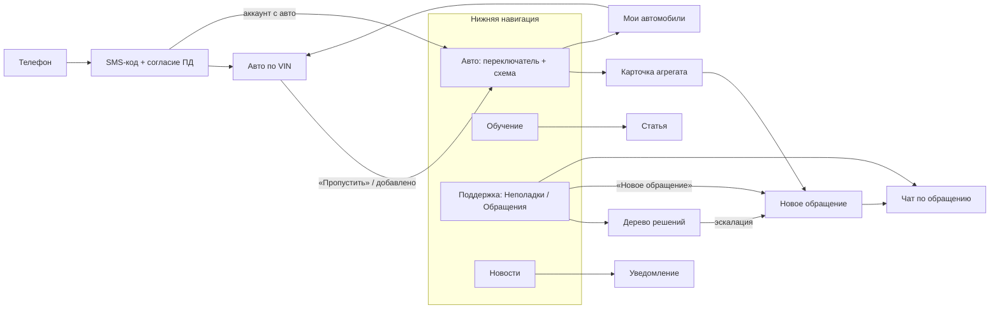

| Экран | Файл | API (OpenAPI v1) |
|---|---|---|
| Телефон | `lib/screens/onboarding/phone_screen.dart` | `POST /auth/phone/request-code` |
| SMS-код + согласие ПД | `lib/screens/onboarding/code_screen.dart` | `POST /auth/phone/verify-code` (`pd_policy_version`) |
| Авто по VIN | `lib/screens/onboarding/add_vehicle_screen.dart` | `POST /vehicles`, `GET /vehicle-models` |
| Авто: переключатель, схема, список | `lib/screens/car/car_screen.dart`, `aggregate_scheme.dart` | `GET /vehicles`, `GET /vehicles/{id}/aggregate-statuses` |
| Карточка агрегата (боттом-шит) | `lib/screens/car/aggregate_sheet.dart` | `GET /vehicles/{id}/maintenance-records` |
| Обучение, статья | `lib/screens/learning/learning_screen.dart` | `GET /knowledge-articles?article_type=guide` |
| Поддержка: неполадки, обращения | `lib/screens/support/support_screen.dart` | `GET /knowledge-articles?article_type=troubleshooting`, `GET /tickets` |
| Дерево решений | `lib/screens/support/decision_tree_screen.dart` | `GET /knowledge-articles/{id}/decision-tree` |
| Новое обращение | `lib/screens/support/ticket_create_screen.dart` | `POST /tickets` (`source_article_id`, `source_node_id`) |
| Чат по обращению | `lib/screens/support/ticket_chat_screen.dart` | `GET/POST /tickets/{id}/messages` |
| Новости (уведомления) | `lib/screens/news/news_screen.dart` | `GET /notifications`, `POST /notifications/{id}/read` |

## Правило 3-х кликов (ТЗ, раздел 6)
Тапы считаются от главного экрана «Авто»; каждый сценарий — автотест в `mobile/test/prototype_test.dart`.

| Сценарий | Путь | Тапов |
|---|---|---|
| Просмотр статуса агрегата | зона на схеме (или строка списка) → карточка | **1** |
| Переход к обучающему материалу | «Обучение» → статья | **2** |
| Создание тикета (форма) | «Поддержка» → «Новое обращение» | **2** |
| Создание тикета на замену агрегата целиком | зона → «Записаться на замену» → «Отправить заявку» (время визита — по желанию, +1) | **3** |
| Статья для другого авто аккаунта (глава 9, U-06) | «Обучение» → переключатель авто → авто → статья | **4** |
| Обращение из дерева неполадок при двух авто (глава 9, U-12) | «Поддержка» → неполадка → 3 ответа → «Создать обращение» → авто → «Отправить» | **8** |

Минимизация ввода: авто и категория тикета — выбором; описание подставляется из карточки агрегата или
из пройденных шагов дерева решений; модель и прошивка прикрепляются автоматически. После юзабилити-теста
(глава 9, `docs/design/usability/`): при двух и более авто и входе не из карточки агрегата авто не подставляется —
обязательный вопрос «По какому автомобилю?»; «Записаться на замену/ТО» открывает форму «Запись на замену/ТО»
с необязательным «Когда удобно приехать» (пожелание уходит в описание — поля времени в API v1 нет), в чате —
плашка «Заявка на запись отправлена. Инженер предложит дату и время в этом чате»; статус `new` в клиенте — «Новое».

## Состояния
| Состояние | Где | Поведение |
|---|---|---|
| Несколько авто | шапка «Авто» и «Обучение» | модель + VIN (последние 4) + «авто: N» → список, «Добавить авто» (тот же переключатель на «Обучении»); схема — только агрегаты из регламента модели (Zeekr 001 — без ДВС); подписи зон — названия агрегатов |
| Без авто | все разделы | «Добавьте автомобиль» с кнопкой; «Обучение» — пояснение; «Новое обращение» скрыто |
| Нет данных о замене | схема, карточка, сводка | статус «Нет данных» (серый, «?») — явный статус, не ошибка (глава 5); сводка: «Нет данных о замене: N — статусы появятся после ТО в сервисе» или «Нет данных: N» рядом с другими счётчиками |
| Нет сети | любой экран с данными | «Нет подключения к интернету» + «Повторить»; при отправке формы — сообщение, введённое не теряется |
| Пусто | «Обращения», «Новости» (фильтр) | пояснение, что здесь появится |
| Ошибки ввода | телефон, код, VIN, согласие ПД, авто в обращении | текст под полем: формат, оставшиеся попытки, 409, выбор модели; ошибка согласия — у галочки; «Выберите автомобиль» — у вопроса (форма прокручивается к нему) |

## Доступность
- Тап-зоны ≥ 44×44 (зоны схемы — 48, тест на непересечение при 360 px).
- Статус — цвет + форма иконки + подпись; у зон схемы — `Semantics` «Масло двигателя: Требуется замена».
- Все разделы без переполнения при 360 px в светлой и тёмной теме (тест).
- Тема дополнена вкладками и чипами только на парах токенов с проверенным контрастом (тест).

## Скриншоты (iPhone 17, iOS Simulator)
| | | |
|---|---|---|
| 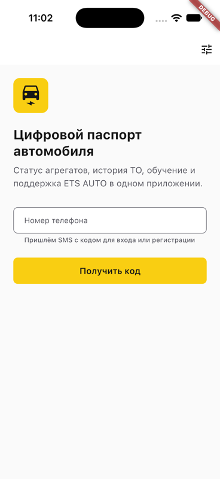 | 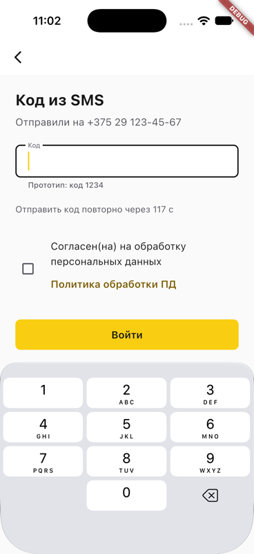 | 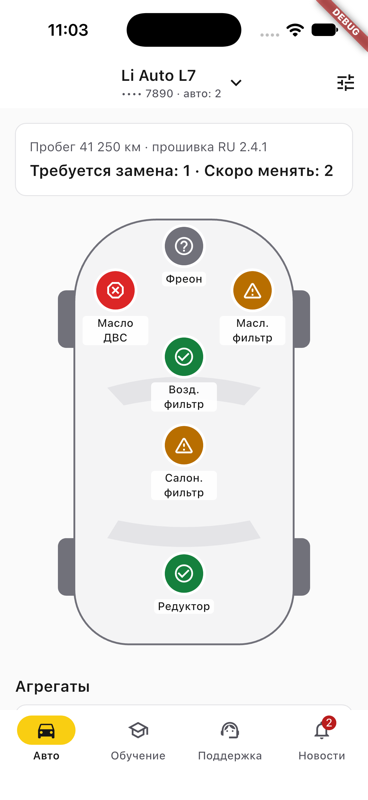 |
| 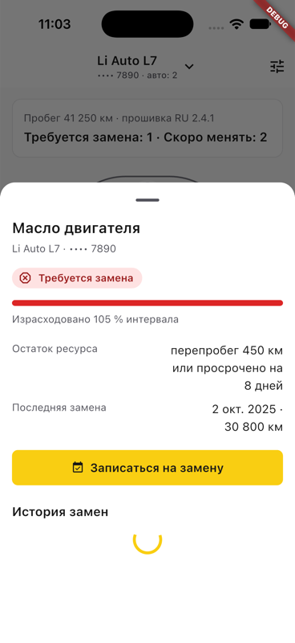 | 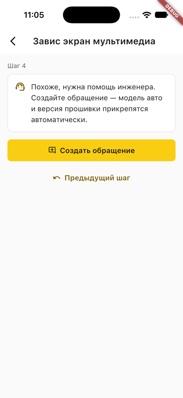 | 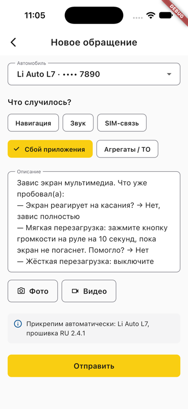 |
| 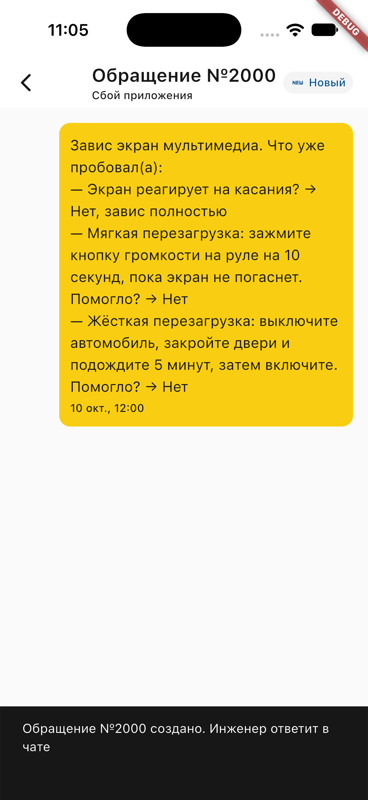 | 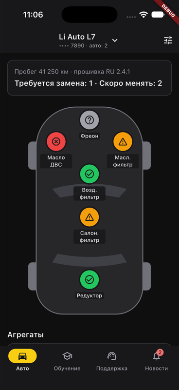 | 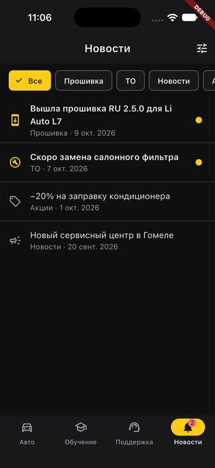 |
| 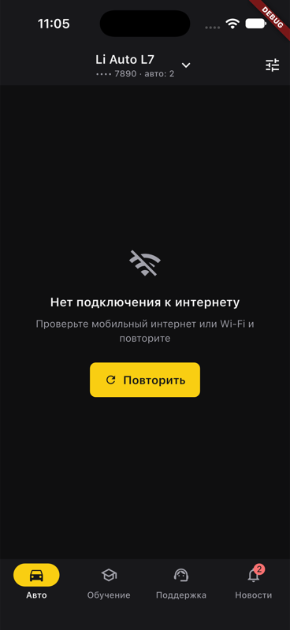 | | |

## Ревью прототипа (DoD)
Проводит владелец с руководителем или потенциальным пользователем на сборке в симуляторе/устройстве.
Чек-лист: пройти онбординг нового клиента; найти агрегат, который требует замены, и записаться;
решить «Завис экран» через дерево решений; найти инструкцию по прошивке; переключить авто; посмотреть
«Нет сети» и «Без авто». Замечания — комментариями в Issue #37.
