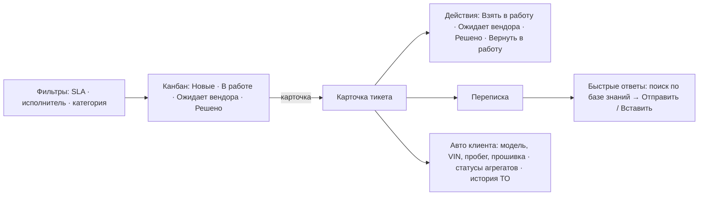
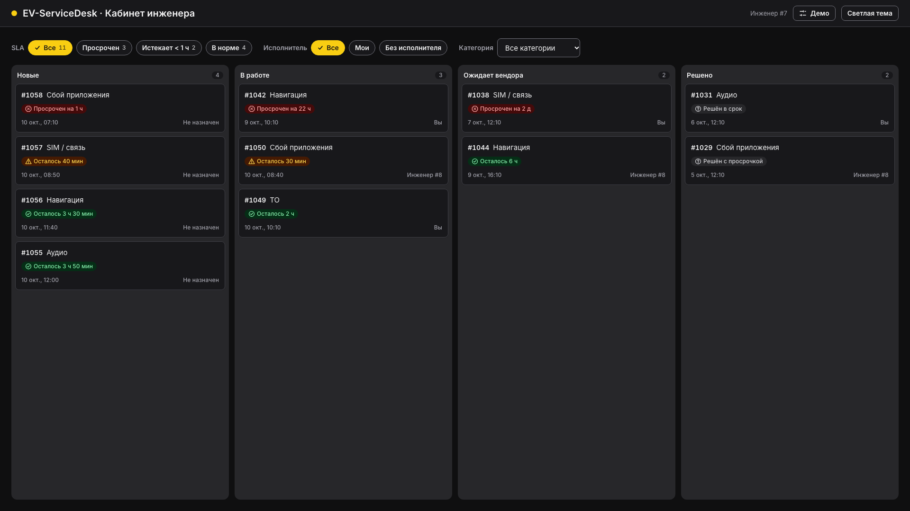
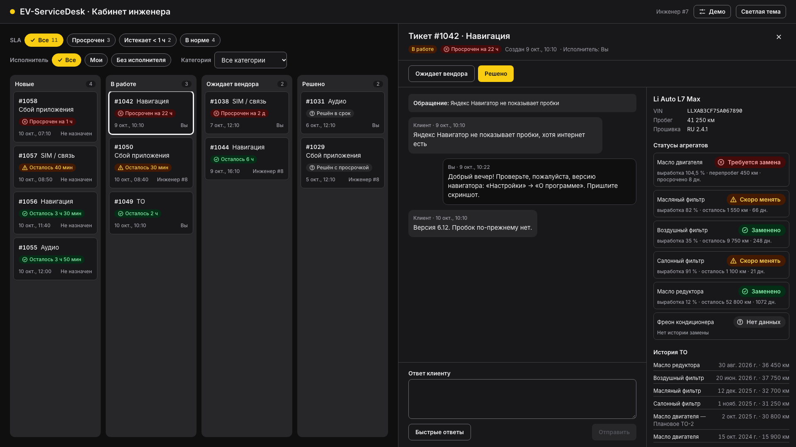
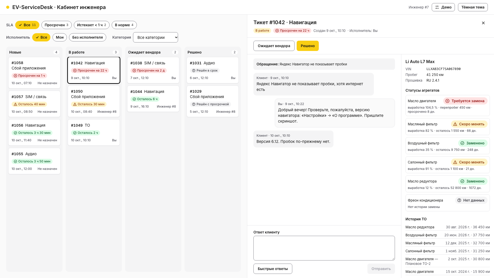
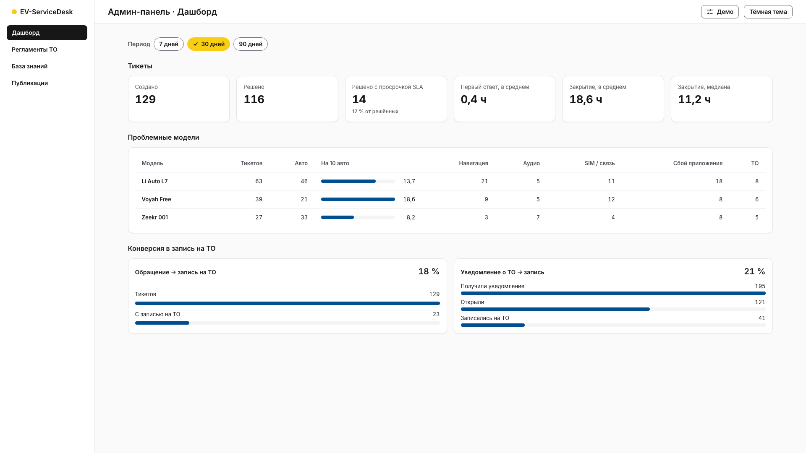
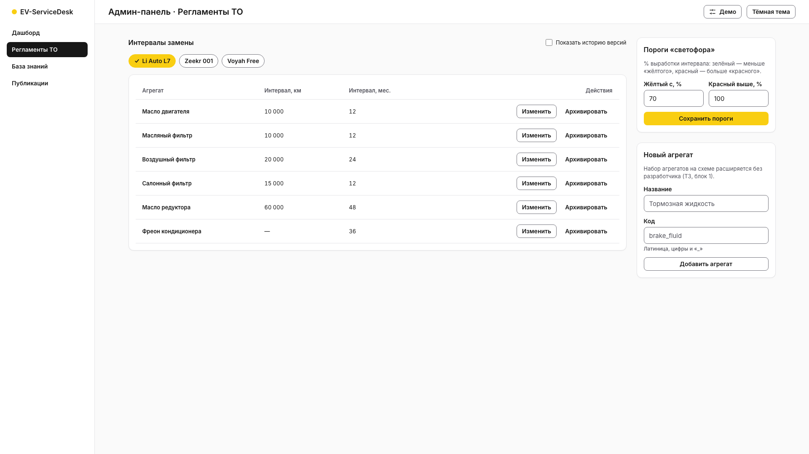
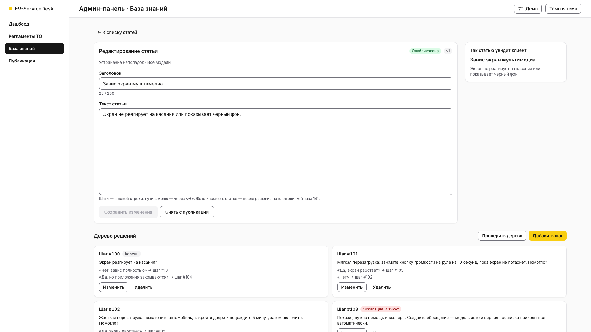
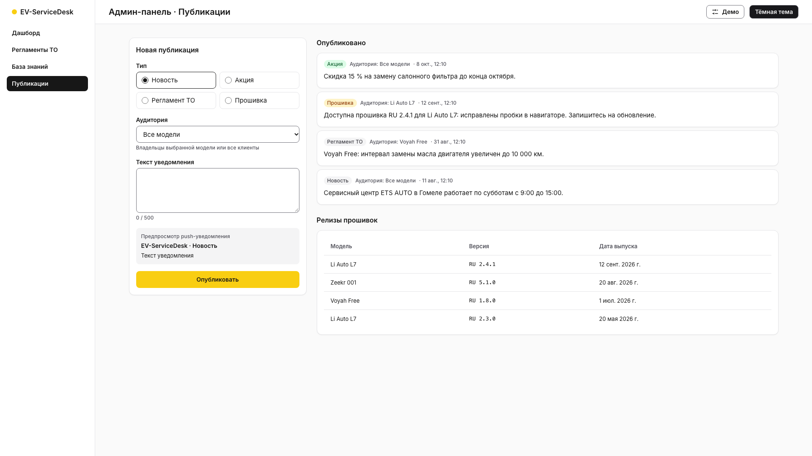
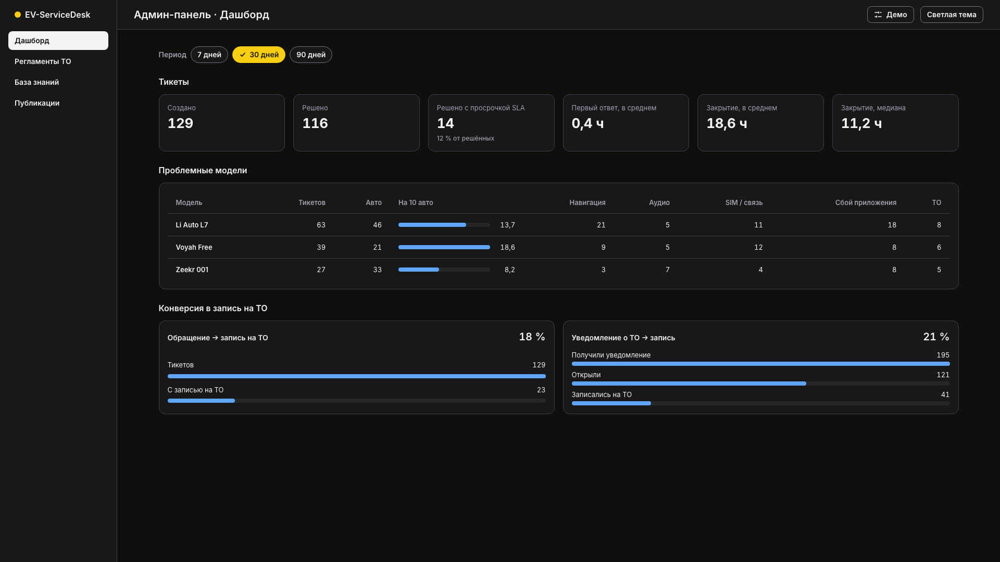

# Прототипы веб-кабинета инженера и админ-панели

Глава 8, Issue #40, ADR 0012. Кликабельные прототипы на React + Tailwind (`web-engineer/`, `web-admin/`) с
фикстурами по схемам `docs/openapi.yaml`; компоненты и темы — дизайн-система главы 6
(`docs/design/DESIGN_SYSTEM.md`). Целевой экран — десктоп Full HD 1920×1080 (ТЗ, раздел 6).

## Запуск
```bash
npm ci
npm run dev -w web-engineer -- --port 5173   # кабинет инженера: http://localhost:5173
npm run dev -w web-admin -- --port 5174      # админ-панель:     http://localhost:5174
npm test                                     # web-shared, web-engineer, web-admin (Vitest)
```
Панель **«Демо»** (кнопка с ползунками в шапке): «Нет сети», данные «Демонстрационные / Пусто», тема,
«Сбросить данные». Экран и тема задаются ссылкой: `http://localhost:5173/?theme=light#/tickets/1042`,
`http://localhost:5174/#/regulations`. Инженер в прототипе — #7, второй инженер — #8, администратор — #1.

## Кабинет инженера
Канбан-доска слева, карточка обращения справа (ТЗ, раздел 9); тёмная тема по умолчанию.



| Экран / блок | Файл | API (OpenAPI v1) |
|---|---|---|
| Канбан-доска, фильтры | `web-engineer/src/board/Board.tsx`, `SlaBadge.tsx` | `GET /tickets` |
| Карточка тикета, действия, переписка | `web-engineer/src/ticket/TicketPanel.tsx` | `GET /tickets/{id}`, `POST /tickets/{id}/claim`, `PATCH /tickets/{id}/status`, `GET/POST /tickets/{id}/messages` |
| Быстрые ответы | `web-engineer/src/ticket/QuickReplies.tsx` | `GET /knowledge-articles?search=` |
| Авто клиента | `web-engineer/src/ticket/VehiclePanel.tsx` | `TicketDetail.vehicle_context`, `GET /vehicles/{id}/maintenance-records` |
| Профиль | `web-engineer/src/App.tsx` | `GET /me` |

**SLA** (ADR 0012, п. 2): «Просрочен» — `is_overdue` или срок прошёл; «Истекает < 1 ч»; «В норме»; у решённых —
«Решён в срок / с просрочкой». Бейдж SLA — цвет + форма иконки светофора + текст («Просрочен на 2 ч 10 мин»,
«Осталось 40 мин»). В колонке — сначала самый ранний срок, в «Решено» — последние решённые.

### Подсчёт кликов: типовые операции инженера
Клик — одно нажатие мыши от открытой доски; ввод текста кликом не считается. Каждая строка — автотест
`web-engineer/src/App.test.tsx`.

| Операция | Путь | Кликов |
|---|---|---|
| Найти просроченные тикеты | чип «Просрочен» | **1** |
| Посмотреть статусы агрегатов и историю ТО авто клиента | карточка тикета | **1** |
| Взять новый тикет в работу | карточка → «Взять в работу» | **2** |
| Перевести в «Ожидает вендора» | карточка → «Ожидает вендора» | **2** |
| Закрыть тикет | карточка → «Решено» | **2** |
| Отправить клиенту инструкцию из базы знаний | карточка → «Быстрые ответы» → «Отправить» у статьи | **3** |
| Ответ по статье с правкой | карточка → «Быстрые ответы» → (поиск) → «Вставить в ответ» → (текст) → «Отправить» | **4** |

Для сравнения: без быстрых ответов инженер набирает инструкцию вручную или копирует её из отдельной базы
знаний (переключение окна, поиск, копирование, вставка).

## Админ-панель
Боковое меню разделов, светлая тема по умолчанию.

| Раздел | Файл | API (OpenAPI v1) |
|---|---|---|
| Дашборд: тикеты, проблемные модели, конверсия в ТО; период 7/30/90 дней | `web-admin/src/dashboard/Dashboard.tsx` | `GET /analytics/ticket-resolution`, `/analytics/problem-models`, `/analytics/maintenance-conversion` |
| Регламенты ТО: интервалы по модели, история версий, архив | `web-admin/src/regulations/Regulations.tsx` | `GET/POST /maintenance-regulations`, `DELETE /maintenance-regulations/{id}` |
| Пороги «светофора», новый агрегат | там же | `GET/PUT /aggregate-status-thresholds`, `GET/POST /aggregate-types` |
| База знаний: список, поиск, фильтры | `web-admin/src/articles/ArticleList.tsx` | `GET /knowledge-articles` |
| Конструктор статьи: черновик → публикация, предпросмотр | `web-admin/src/articles/ArticleEditor.tsx` | `POST /knowledge-articles`, `GET/PATCH/DELETE /knowledge-articles/{id}`, `GET /firmware-releases` |
| Дерево решений: шаги, варианты, проверка | `web-admin/src/articles/DecisionTreeEditor.tsx` | `GET/POST /knowledge-articles/{id}/decision-tree`, `…/validate`, `PATCH/DELETE /decision-tree-nodes/{id}` |
| Публикации: новость / акция / регламент ТО / прошивка, таргетинг по модели, предпросмотр push | `web-admin/src/publications/Publications.tsx` | `POST /notifications`, `GET/POST /firmware-releases`; лента — нет в v1 (ADR 0012, п. 5) |

Изменение интервала — **пересмотр**: прошлая версия уходит в историю («Показать историю версий»), расчёты по
прошлым ТО не меняются (`reviseMaintenanceRegulation`). Статья «Устранение неполадок» не публикуется, пока
проверка дерева находит ошибки.

Выбор в выпадающем списке и ввод текста — в скобках, кликами не считаются; строки — автотесты
`web-admin/src/App.test.tsx`.

| Операция администратора | Кликов (+ ввод) |
|---|---|
| Изменить интервал замены | «Изменить» → (интервал) → «Сохранить» — **2** |
| Опубликовать новость для всех | (тема, текст) → «Опубликовать» — **1** |
| Выпустить прошивку с уведомлением владельцам модели | «Прошивка» → (модель, версия) → «Опубликовать» — **2** |
| Опубликовать черновик статьи | статья в списке → «Опубликовать» — **2** |

## Состояния
| Состояние | Где | Поведение |
|---|---|---|
| Загрузка | любой блок с данными | «Загрузка…» со спиннером (`role="status"`), прежние данные не пропадают |
| Нет сети | любой блок с данными, действия | «Нет соединения с сервером…» + «Повторить»; ошибка действия — рядом с кнопкой, ввод не теряется |
| Пусто | доска, статьи, лента, проблемные модели | пояснение и, где есть, действие («Создать статью») |
| Ошибки ввода | интервалы, пороги, агрегат, статья, шаг дерева, публикация | текст ошибки под формой (коды контракта: 422, 409, 403) |
| Чужой тикет | карточка тикета | действия скрыты, ответ недоступен: «Тикет ведёт Инженер #8» |

## Full HD и доступность
- 1920×1080: без горизонтальной прокрутки (проверено в браузере, `scrollWidth = 1920`); доска и карточка
  тикета — на всю высоту окна, прокрутка внутри колонок и переписки.
- Темы: светлая и тёмная на семантических токенах (контраст — тесты главы 6); тёмная — по умолчанию у инженера.
- Статусы (SLA, агрегаты, публикация статьи) — цвет + иконка/текст; выбранный чип — `aria-pressed` и галочка.
- Клавиатура: все действия — кнопки и ссылки; `Escape` закрывает карточку тикета; фокус переходит на заголовок
  открытой карточки; разделы админки — ссылки с `aria-current`.

## Скриншоты (1920×1080)
| | |
|---|---|
|  |  |
|  |  |
|  |  |
|  |  |

## Ревью прототипов (DoD)
Проводит владелец (при возможности — с инженером поддержки) на сборке в браузере при 1920×1080. Чек-лист:
1. Инженер: найти просроченные тикеты; взять новый тикет в работу; ответить клиенту инструкцией из базы
   знаний; посмотреть статусы агрегатов авто клиента; перевести тикет в «Ожидает вендора» и закрыть его;
   проверить тёмную и светлую тему, «Нет сети», «Пусто».
2. Админ: изменить интервал замены масла для модели и найти прошлую версию; поменять пороги «светофора»;
   создать и опубликовать статью; добавить шаг-тупик в дерево и увидеть ошибку проверки; опубликовать
   новость и релиз прошивки; сравнить показатели дашборда за 7 и 30 дней.
3. Открытые вопросы контракта (ADR 0012, п. 5): лента публикаций для админа, модель авто и описание в
   элементе списка тикетов, вложения статей — подтвердить перенос в главы 13–15.

Замечания — комментариями в Issue #40.
